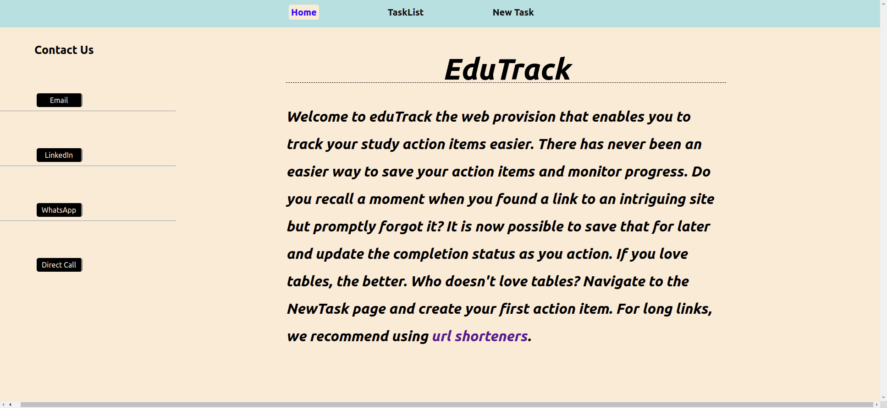
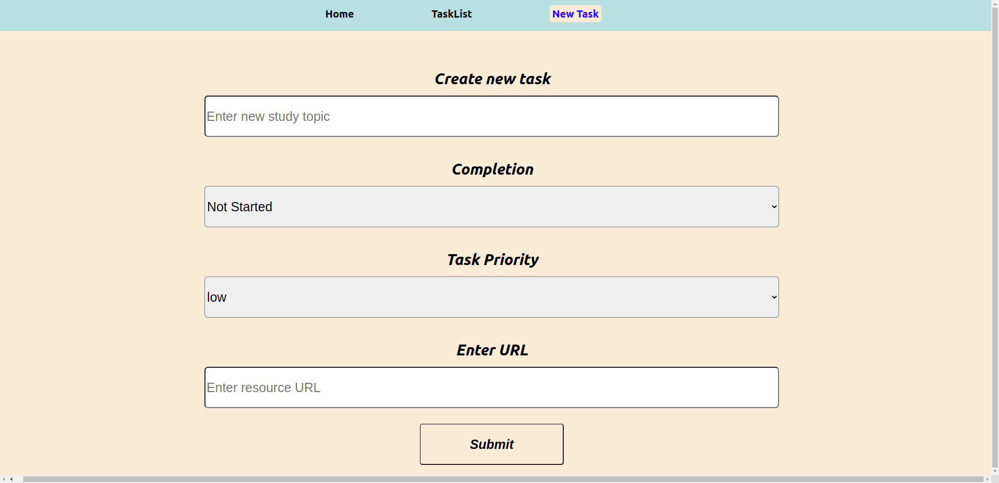
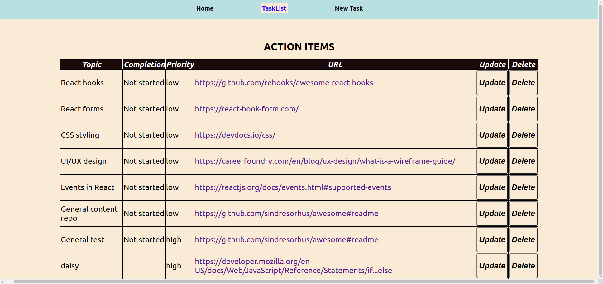

# eduTrack

## Developed by:
    Bernard Ngari

## Landing Page

## New Task Page

## Task Page

## Table Of Content

+ [Description](#Description)
+ [Features](#Features)
+ [Requirement](#Requirement)
+ [Installation-process](#Installation-process)
+ [Technologies-used](#Technologies-used)
+ [Live-Link](#Live-Link)
+ [License](#License)
+ [Authors-info](#Authors-info)

## Description

This project was built as an evaluation of my React.js skills. I made this for personal use, so I could easily create their items and reference them later. I mostly study online so this makes it easy to paste URLs to relevant resources and have the changes on a server.

## Features
A user will be able to:
1. Create a new action item and have it persist on a server.
2. Delete an action item.
## Requirement
In order to use this web app, you will need:
* A device to with a browser;either a smartphone, tablet or desktop computer.
* An active internet connection.

## Installation-process
To test the web-app, you may run it from this [link](https://edutrack.herokuapp.com/)
If you wish to clone and experiment with some features, you clone [here](https://github.com/Bernardngari/edutrack-frontend)

## Technologies-used
* Reactjs was used to create the components/structure.
* CSS was used to style the page.

## Live-Link
The app is hosted on Heroku at this [link](https://edutrack.herokuapp.com/)

## Authors-info

* [Github](https://github.com/Bernardngari)
* [LinkedIn](https://www.linkedin.com/in/bernardngari/)

## License
[MIT]()
